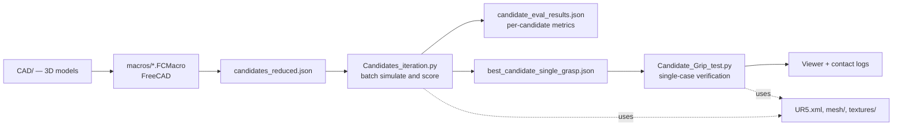

# Gripping Parameter Estimation

Simulation framework for finding reliable grasp parameters for a UR5 with a parallel-jaw gripper. Grasp candidates are generated from a CAD model, scored in bulk in MuJoCo, and the best one is re-run on its own for verification — so grip points and forces are settled before anything is tried on hardware.

Master's thesis, M.Sc. Mechatronics, University of Siegen (Chair of Interconnected Automation Systems) in cooperation with Fraunhofer IGCV, Augsburg.

---

## How it works

The project runs as three stages, each handing a JSON file to the next.

**1 — Generate candidates (FreeCAD).** A macro from `macros/` reads the object's CAD model and writes out a set of candidate grasps: for each one, where the gripper approaches from (`pre_grip`) and where it closes (`grip_point`). Output: `candidates_reduced.json`.

**2 — Score them all (MuJoCo).** `Candidates_iteration.py` loads that file and simulates every candidate in turn against the `UR5.xml` scene: approach, close, lift, and measure. Each candidate gets contact-force and slip metrics. Everything scored lands in `candidate_eval_results.json`; the winner is written separately to `best_candidate_single_grasp.json`.

**3 — Verify the winner.** `Candidate_Grip_test.py` re-runs that single grasp on its own, with the viewer available and full contact traces logged. This is where you watch the grip and confirm the batch score wasn't an artefact.



## Files

| File / folder | Role |
|---|---|
| `macros/` | FreeCAD macros (`grip_iteration.FCMacro`, `grip_new.FCMacro`) that turn a CAD model into candidate grasps. Run from inside FreeCAD, not the terminal. |
| `candidates_reduced.json` | The candidate list produced by the macros — input to the batch run. Also serves as the reference for the expected format. |
| `Candidates_iteration.py` | Batch evaluator. Simulates every candidate, scores stability, filters, and picks the best. The main script of the project. |
| `candidate_eval_results.json` | Per-candidate metrics from the batch run. The evaluation plots in the thesis come from this file. |
| `best_candidate_single_grasp.json` | The single top candidate, in the same format as the input list. |
| `Candidate_Grip_test.py` | Single-case runner. Loads the best candidate, simulates it with the viewer and detailed logging. Used for debugging and for the final visual check. |
| `UR5.xml` | The MuJoCo scene: UR5 arm, parallel-jaw gripper, object, and ground. Both scripts load this. |
| `xml_files/` | Alternative scene variants — different objects or gripper settings. Point `XML_PATH` at one of these to swap scenes. |
| `mesh/`, `textures/` | Collision and visual assets referenced by the MuJoCo models. |
| `CAD/` | Source CAD models (`battery.stl`, `casing_new.stl`) that the macros work from. |
| `Report/` | Thesis PDF and presentation. |
| `macros/battery_grip_data.json` | Legacy example data. Not used by the current pipeline. |

## Running it

```bash
pip install mujoco numpy
```

FreeCAD is installed separately and is only needed for stage 1.

```bash
python Candidates_iteration.py    # stage 2 — batch evaluation
python Candidate_Grip_test.py     # stage 3 — verify the winner
```

Both scripts read paths from constants at the top of the file. If MuJoCo fails to load the scene, check `XML_PATH` points at `UR5.xml` and that `mesh/` and `textures/` are reachable from it.

## Parameters

Both scripts expose their tuning constants at the top:

| Constant | Controls |
|---|---|
| `T_HOME_SETTLE`, `T_TO_PRE`, `T_TO_GRIP` | Motion timing between phases |
| `CLOSE_MAG`, `CLOSE_RAMP_TIME` | How hard and how fast the gripper closes |
| `TARGET_PINCH` | Commanded jaw width at the grip |
| `FRICTION_MULT`, `GRIPPER_STRENGTH_MULT` | Scaling on contact friction and actuator strength |

Changing these changes what counts as a successful grasp, so keep them consistent between the batch run and the verification run — otherwise the winner won't reproduce.

## Thesis and assets

- Thesis: [`Report/Sepasthiyammal,Milton,1702059_Thesis.pdf`](Report/Sepasthiyammal,Milton,1702059_Thesis.pdf)
- Presentation: [`Report/Thesis Presentation.pptx`](Report/Thesis%20Presentation.pptx)
- Methodology, experimental results, and the evaluation plots derived from `candidate_eval_results.json` are all in the thesis.

## Built with

[MuJoCo](https://github.com/google-deepmind/mujoco) · [FreeCAD](https://www.freecad.org/) · Universal Robots UR5

